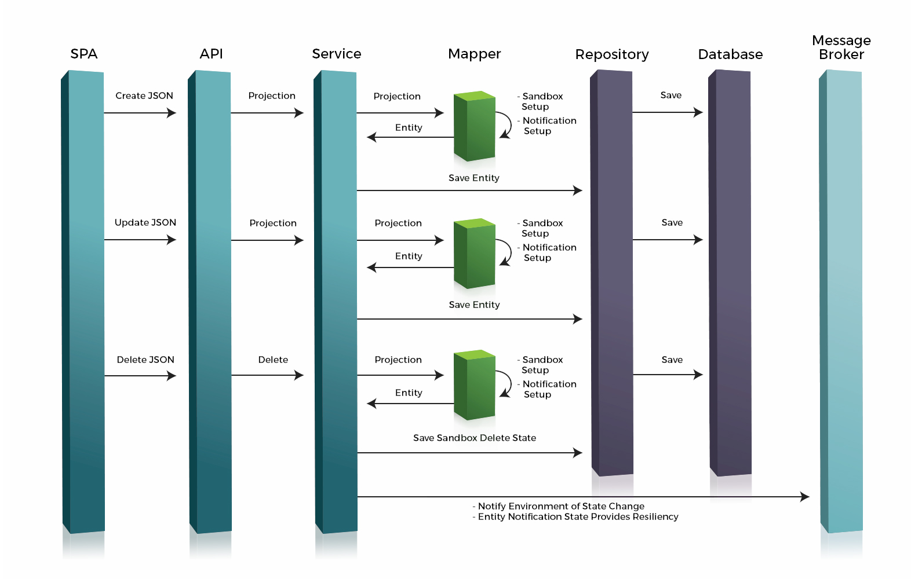

== Service Anatomy Overview

The diagram below provides a good high level overview depicting the different layers that a request
can go through as it flows through a particular service. The key takeaway is that that every layer
in the architecture can be customized and extended to fit unique business needs and requirements.

