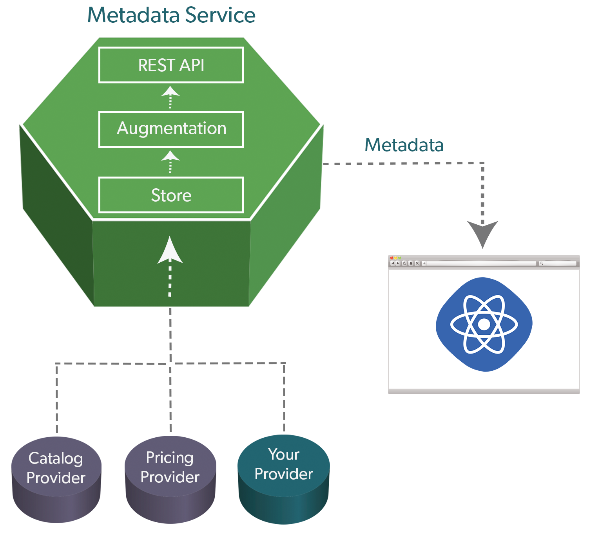

:toc:
:icons: font
:source-highlighter: prettify
:sectnums:
ifdef::env-github[]
:tip-caption: :bulb:
:note-caption: :information_source:
:important-caption: :heavy_exclamation_mark:
:caution-caption: :fire:
:warning-caption: :warning:
endif::[]

= Customization & Extension Guide

The following guides will help you work with and develop extensions on top of the
backend APIs and microservices framework provided with Broadleaf.

They are a great way to experience some core fundamentals before diving into more complex scenarios.

[NOTE]
====
The guides here assume you are building these customizations on a base project that has
already been set up for you. Take a look at `MicroservicesTutorial/ms-tutorial-base`
or `MicroservicesStarter` for details.

Also be aware that this project is set up to only load the `Catalog` microservice
alongside some additional supporting services. Not all backend commerce APIs
are needed for the scope of this tutorial.
====

[TIP]
====
We recommend following along with this guide in the order in which it is presented. Each section
may build on and reference extensions created in a previous section. 

Once you're done,
you can check your results against the code in this project:
`MicroservicesTutorial/ms-tutorial-extension-complete`
====

== Service Anatomy Overview

Before we begin, it's best to understand the general anatomy of every Broadleaf microservice.
The diagram below provides a good high level overview depicting the different layers that a request
can go through as it flows through a particular service. The key takeaway is that that every layer
in the architecture can be customized and extended to fit unique business needs and requirements.
In these tutorials, we'll be walking you through typical customizations paths that touch some
of these different layers.

image::../images/MS_Service_Anatomy.jpg[]

== Product Repository Domain

In this section, we're going to cover how to extend the actual `Product` *repository* domain so that
we can keep track of a new attribute directly on the persisted entity.

=== Overview
Broadleaf leverages https://spring.io/projects/spring-data[Spring Data] for entity persistence.
Spring Data supports polymorphism as part of the data interaction, which facilitates standard
Java OOP extension of out-of-the-box Broadleaf repository domain classes.
Fields may be added in extensions to support additional business
requirements. Also, mutator methods can be overridden for additional customization.

Queries through existing Broadleaf repositories should return the more derived repository domain
as appropriate. As well, creation of entity state should be accurate to the more derived type.

[NOTE]
====
We're continually adding new features and capabilities to enhance the developer experience.
We recommend checking back often to see any new features and tools that will be added to
help provide a seamless customization experience.
====

=== Extension Example
We're going to create a simple `String` property on `JpaProduct` to demonstrate extending a base
framework *repository* domain.

[source,java]
----
import com.broadleafcommerce.catalog.provider.jpa.domain.product.JpaProduct;

import javax.persistence.Column;
import javax.persistence.Entity;
import javax.persistence.Table;

import lombok.Data;
import lombok.EqualsAndHashCode;

@Entity
@Table(name = "TUTORIAL_PRODUCT")
@Data
@EqualsAndHashCode(callSuper = true)
public class TutorialJpaProduct extends JpaProduct {

    private static final long serialVersionUID = 1L;

    @Column(name = "MY_PROPERTY")
    private String myProperty;

}
----

Next, you'll want to inform the system of your new entity. You can do this by specifying
a `@JpaEntityScan` for your particular package. It may look something like this:

[source,java]
----
@Configuration
@JpaEntityScan(basePackages = "com.broadleafsamples.tutorials.services.catalog.provider.jpa.domain",
        routePackage = "com.broadleafcommerce.catalog")
@AutoConfigureAfter(CatalogJpaAutoConfiguration.class)
public class TutorialCatalogConfig {

    // other beans and configurations here

}
----

== Additional Spring Components

In this section, we'll walk through extending other interesting components in the framework which
would be typical in an actual implementation.

=== Product Export Customization using `withExample()`
We're going to extend framework's `Product` `Export Row Converter` in order to add the simple
additional property that we've added to the repository domain. This will allow
the default `Product Export` jobs to utilize the new extended attributes when producing the
`CSV` file.

[source,java]
----
import static com.broadleafcommerce.common.extension.reflection.InvocationUtils.withExample;

import com.broadleafcommerce.catalog.dataexport.converter.ProductExportRowConverter;
import com.broadleafcommerce.catalog.dataexport.converter.ToStringConverter;
import com.broadleafcommerce.catalog.dataexport.converter.support.ConversionUtils;
import com.broadleafcommerce.catalog.domain.product.Product;
import com.broadleafsamples.tutorials.services.catalog.provider.jpa.domain.TutorialJpaProduct;

import java.util.LinkedHashSet;
import java.util.Map;

import lombok.NonNull;

public class TutorialProductExportRowConverter extends ProductExportRowConverter { // <1>

    public TutorialProductExportRowConverter(@NonNull ToStringConverter<Object> toStringConverter) {
        super(toStringConverter);
    }

    @Override
    public LinkedHashSet<String> getHeaders() { // <2>
        LinkedHashSet<String> headers = super.getHeaders();
        headers.add(TutorialFields.MY_PROPERTY);
        return headers;
    }

    @Override
    public Map<String, String> convert(Product source) { // <3>
        Map<String, String> result = super.convert(source);
        ConversionUtils.putIfNotNull(TutorialFields.MY_PROPERTY,
                withExample(TutorialJpaProduct.class).andTarget(source).getMyProperty(), result); // <4>
        return result;
    }

    public static class TutorialFields extends Fields {
        public static final String MY_PROPERTY = "myProperty";
    }

}
----
<1> Extend the framework's `ProductExportRowConverter`
<2> Override the `getHeaders()` method to call `super()` and define your new property
<3> Override the `convert()` method to call `super()` and define your new property
<4> Since we've defined a `TutorialJpaProduct` with an extended attribute, and this method passes in
a "Projection" domain of `Product` (which he have not explicitly extended),
we can utilize the `withExample` syntax to extrapolate this new property from the base "Product"
even though we haven't explicitly extended it.

[IMPORTANT]
====
You must still register your component with Spring either by component scanning or explicitly
defining the `@Bean` in your own configuration class e.g.

[source,java]
----
@Bean
public TutorialProductExportRowConverter customProductExportRowConverter(
        ToStringConverter<Object> toStringConverter) {
    return new TutorialProductExportRowConverter(toStringConverter);
}
----
====

== Admin Metadata Customizations

In this section, we'll go over how to manage your simple property that you've added to
both the projection and repository domains.

==== Overview

The following diagram is a high level diagram that depicts the Metadata "Pipeline"
in which it is responsible for rendering navigation, requesting view metadata,
requesting user allowed scopes for views, requesting access tokens, rendering the view,
and finally, requesting CRUD on the domain service.

1. the metadata service receives its initial set of metadata from a variety of sources
(metadata providers)

2. Each Broadleaf Microservice has a provider out-of-box, like catalog and pricing, which provide
the metadata needed for those services

3. the metadata from these providers is then stored in the metadata service

4. when the client requests metadata for a view from the REST API, the metadata is processed by
an augmentation layer before being returned to the client

[TIP]
====
this augmentation layer is another useful extension point for making modification to the metadata
before it’s returned to the client
====

==== Extension Example
For this example, we'll extend the `CatalogService` default metadata provider and add a reference
to the new attribute we've added to `Product`.

In order to do this, we'll need to create a new Metadata Config class that extends some built in
product components.

[source,java]
----
import org.springframework.context.annotation.Configuration;
import org.springframework.stereotype.Component;

import com.broadleafcommerce.catalog.metadata.product.CommonPriceDataComponents;
import com.broadleafcommerce.catalog.metadata.product.IncludedProductFields;
import com.broadleafcommerce.catalog.metadata.product.NonSkuPriceDataComponents;
import com.broadleafcommerce.catalog.metadata.product.ProductFields;
import com.broadleafcommerce.catalog.metadata.product.ProductForms;
import com.broadleafcommerce.catalog.metadata.product.ProductOptionFields;
import com.broadleafcommerce.catalog.metadata.product.ProductOptionForms;
import com.broadleafcommerce.catalog.metadata.product.PromotionalProductFields;
import com.broadleafcommerce.catalog.metadata.product.VariantFields;
import com.broadleafcommerce.catalog.metadata.product.pricing.PriceDataFields;
import com.broadleafcommerce.metadata.domain.FieldComponent;
import com.broadleafcommerce.metadata.domain.builder.EntityFormBuilder;

@Configuration
public class TutorialMetadataConfig {

    @Component
    class TutorialProductFields extends ProductFields {  // <1>

        public static final String MY_PROPERTY = "myProperty";

        public TutorialProductFields() {
            super();
            add(FieldComponent.builder(MY_PROPERTY)
                    .label("My Property")
                    .required(false)
                    .translatable(false));
        }

    }

    @Component
    class TutorialProductForms extends ProductForms {  // <2>

        public TutorialProductForms(ProductFields productFields,
                ProductOptionFields productOptionFields, VariantFields variantFields,
                PromotionalProductFields promotionalProductFields,
                IncludedProductFields includedProductFields, PriceDataFields priceDataFields,
                CommonPriceDataComponents commonPriceDataComponents, ProductOptionForms optionForms,
                NonSkuPriceDataComponents nonSkuPriceDataComponents) {
            super(productFields, productOptionFields, variantFields, promotionalProductFields,
                    includedProductFields, priceDataFields, commonPriceDataComponents, optionForms,
                    nonSkuPriceDataComponents);
        }

        @Override
        protected EntityFormBuilder generalForm() {
            return super.generalForm()
                    .addField(getProductFields().get(TutorialProductFields.MY_PROPERTY)
                            .order(20000).build());
        }
    }
}
----
<1> Create a new Spring Component to extend the framework's `ProductFields` component.
Call `super()` and add you new custom field component.
<2> Create a new Spring Component to extend the framework's `ProductForms` to override
the `generalForm()` builder. Call `super()` and add your new field to the metadata.

== Putting It All Together

Now that we have all the customizations and extensions in place, let's go ahead and re-build
our application and re-start our backend services.

With the customizations above, we should:

- see our new simple property field on `Product` be manageable in the Admin
- whenever a new `Product` is created through the admin, you should see some
information logging in your console that was added in Step 4
- when you create a new `Product` and create a new `Export` job that references this new product,
the resulting CSV should also contain a new header and column with the appropriate extended field

== Customizing a Service

In this section, let's walk through customizing the service tier.

=== Overview
The service tier is responsible for executing business logic against projections and represents
the main source of business requirement fulfillment in the microservice. Like other Broadleaf
components, service components load in a deferred loader and will be ignored if another bean of
the same type is already registered. This allows for an extended service to be loaded instead of
the out-of-the-box Broadleaf service. Existing methods may be overridden, or new ones introduced.

=== Extension Example
Let's add some additional logging to denote how you may want to hook into the execution of certain
business flows. In this case, let's add some arbitrary logging in the creation flow of a `Product`.

[source,java]
----
import com.broadleafcommerce.catalog.repository.product.ProductRepository;
import com.broadleafcommerce.catalog.service.product.DefaultProductService;
import com.broadleafcommerce.catalog.service.product.VariantService;
import com.broadleafcommerce.data.tracking.core.context.ContextInfo;
import com.broadleafcommerce.data.tracking.core.service.RsqlCrudEntityHelper;

import lombok.extern.apachecommons.CommonsLog;

@CommonsLog
public class TutorialProductService extends DefaultProductService {  // <1>

    public TutorialProductService(ProductRepository repository, RsqlCrudEntityHelper helper,
            VariantService variantService) {
        super(repository, helper, variantService);
    }

    @Override
    public Object create(Object businessInstance, ContextInfo context) { // <2>
        log.info("EXTENSION TUTORIAL - DEMONSTRATE EXECUTION OF CUSTOM BUSINESS LOGIC");
        return super.create(businessInstance, context);
    }
}
----
<1> Extend the framework's `DefaultProductService`
<2> Override the `create()` method, add a custom logging message, and call `super()`

[IMPORTANT]
===
You must still register your component with Spring either by component scanning or explicitly
defining the `@Bean` in your own configuration class e.g.

[source,java]
----
@Bean
public ProductService<Product> customProductService(
        ProductRepository<Trackable> productRepository,
        RsqlCrudEntityHelper helper,
        VariantService<Variant> variantService) {
    return new TutorialProductService(productRepository, helper, variantService);
}
----
===

== API Endpoints

=== Overview
Broadleaf API endpoints are backed by Spring Rest Controllers.
The rest controller represents the outward facing API for the microservice. Most commonly,
this component is responsible for little more than de-serializing/serializing JSON input/output
and then passing off to a service component. Out-of-the-box rest controllers may be extended
using standard Java OOP extension. Broadleaf singleton components are annotated to conditionally
load only if a bean of their type does not already exist. And since Broadleaf components are
loaded during the autoconfiguration phase (deferred loader), their ordering is post developer
extensions. Methods may be added or overridden to accomplish new or customized endpoints.
As mentioned in the Business Domain section, Spring Converters may be registered to de-serialize
JSON into more derived business domain types upon endpoint entry. Furthermore, customization of the
JSON output can be achieved with a combination of a `JSONSerializer` implementation and the
`@JsonComponent` annotation. This provides flexibility to hide unwanted fields, modify
field name, etc…​
